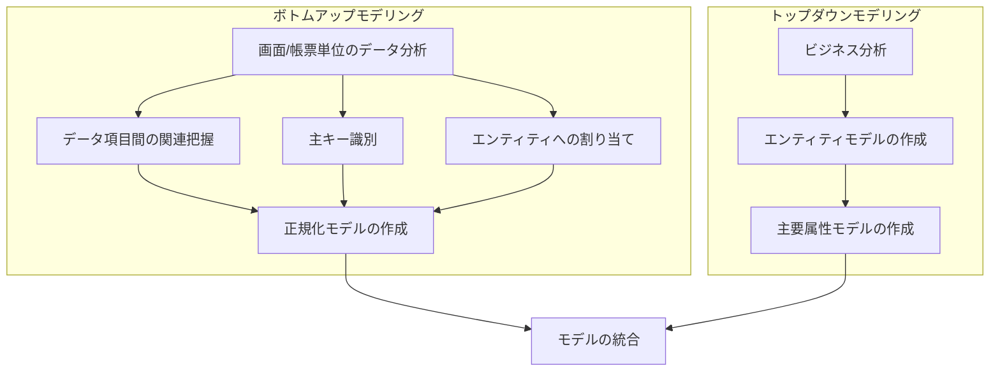
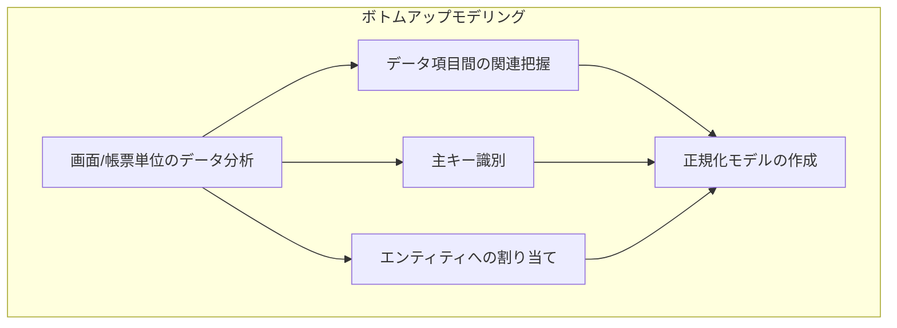
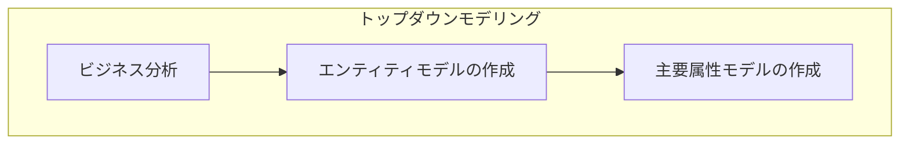

---
# try also 'default' to start simple
theme: seriph
# random image from a curated Unsplash collection by Anthony
# like them? see https://unsplash.com/collections/94734566/slidev
background: https://source.unsplash.com/collection/94734566/1920x1080
# apply any windi css classes to the current slide
class: 'text-center'
# https://sli.dev/custom/highlighters.html
highlighter: shiki
# show line numbers in code blocks
lineNumbers: false
# some information about the slides, markdown enabled
info: |
  ## Slidev Starter Template
  Presentation slides for developers.

  Learn more at [Sli.dev](https://sli.dev)
# persist drawings in exports and build
drawings:
  persist: false
---

# 実践的データモデリング入門

---

# データベースの論理設計

アプリケーションの設計には多くのベストプラクティスがある。

しかしデータベースの論理設計の方法を体型的にを教えてくれる物は少ない。

なので感覚的に設計をしてしまうことが多いが実はそれは恐ろしい。

なぜなら一度作成したテーブルの設計を途中で変えるのは、

アプリケーションの修正とは比べ物にならないほどに影響範囲が大きい。

 

&rarr; 初めから確度の高いテーブル設計ができるように論理設計の手法を学ぶ

---
layout: two-cols
---

<template v-slot:default>

# 参考にした図書

  

</template>
<template v-slot:right>

[実践的データモデリング入門](https://www.amazon.co.jp/%E5%AE%9F%E8%B7%B5%E7%9A%84%E3%83%87%E3%83%BC%E3%82%BF%E3%83%A2%E3%83%87%E3%83%AA%E3%83%B3%E3%82%B0%E5%85%A5%E9%96%80-DB-magazine-selection-%E7%9C%9F%E9%87%8E/dp/4798103853/ref=sr_1_1?__mk_ja_JP=%E3%82%AB%E3%82%BF%E3%82%AB%E3%83%8A&crid=3ABFLARSAHY98&keywords=%E5%AE%9F%E8%B7%B5%E7%9A%84%E3%83%87%E3%83%BC%E3%82%BF%E3%83%A2%E3%83%87%E3%83%AA%E3%83%B3%E3%82%B0%E5%85%A5%E9%96%80&qid=1651626715&sprefix=%E5%AE%9F%E8%B7%B5%E7%9A%84%E3%83%87%E3%83%BC%E3%82%BF%E3%83%A2%E3%83%87%E3%83%AA%E3%83%B3%E3%82%B0%E5%85%A5%E9%96%80%2Caps%2C219&sr=8-1)

DB の物理設計についての本はいろいろあるが、論理設計の部分にフォーカスしたちょっと珍しい本。

2003 年発売の古い本ではあるが、DB の論理設計の部分だけ見れば普遍的な内容が書かれている。

</template>

---

# データベース論理設計の流れ

---
layout: two-cols
---

<template v-slot:default>

# ボトムアップモデリング

</template>
<template v-slot:right>

## 手順

1. 対象領域となる画面や帳票を集める。
1. Excel などで所属エンティティ、データ項目名などを整理する。
1. データ項目に型、長さを定義する。
1. 初期のデータモデルを整理する。
1. 正規化する。
1. 発生タイミングなどによりエンティティを分離する。

</template>

---

# 画面、帳票を集める

  
  
  

---

# Excel で整理する

<arrow v-click="1" x1="250" y1="120" x2="300" y2="150" color="#564" width="3" arrowSize="1" />

①画面から必要な項目を列挙する

<arrow v-click="2" x1="500" y1="100" x2="400" y2="170" color="#564" width="3" arrowSize="1" />

②画面単位でエンティティを括る

<arrow v-click="3" x1="580" y1="520" x2="600" y2="480" color="#564" width="3" arrowSize="1" />

③重複のない正式データ項目を付与する

<arrow v-click="4" x1="800" y1="250" x2="750" y2="230" color="#564" width="3" arrowSize="1" />

④繰返項目を抽出

---

# 初期モデルを作成する

---

# 正規化を行う

## 正規化の 1st ステップ

繰り返し項目を取り除く

---

# 正規化を行う

## 正規化の 2nd ステップ

複合キーの一部に従属する属性は別エンティティとする

---

# 正規化を行う

## 正規化の 3rd ステップ

主キー以外の項目に依存する項目は別エンティティとする

---
layout: two-cols
---

<template v-slot:default>

# トップダウンモデリング

</template>
<template v-slot:right>

## 手順

1. ビジネスフローの作成
1. エンティティの抽出
1. エンティティ間の関連付け
1. 主キーと主要属性の定義

</template>

---

# ビジネスフローの作成

---

# 業務フローの作成

ちょっと縦に長いので別リンクにて...

https://app.diagrams.net/#G1u88HRtHr7mV-y-TSU0bh9elAlgN9RuZf

---

# エンティティの抽出

何をエンティティとして抽出するか

### リソース系エンティティ

主語や述語になるような名詞で表現できるもの

- 人（社員、顧客）、組織（部署、工場）
- 物（商品）、設備（配送拠点）
- 顧客（出品者、購入者）

 

### イベント系エンティティ

一連の活動を構成するアクティビティ

- 購入、取引
- 配送、納品
- 入金、返金

---

# リソース系エンティティの抽出

- 人
  - 管理者、MD、TS
  - PS
- 物
  - 商品
  - 特集商品
  - 商品画像

---

# リソース系エンティティの関連付け

---

# イベント系エンティティの抽出

- Zendesk
- 商品審査, 正規品証明, 画像権利
- 商品画像審査

---

# イベント系エンティティの関連付け

---

# イベントとリソースの関連付け

---

# 主キーと主要属性の定義

- 主キー候補の選定
  - 値の変わらないもの
  - できるだけ桁数の短いもの
  - 複合キーの場合は連結個数が少なくなるようにする
  - 非 NULL 項目でないこと

上記を満たせない場合は、独自のキー（サロゲートキー）を設ける。

---

# 最終的に作成したモデル

---

# ボトムアップモデルとトップダウンモデルの統合

### 手順

1. エンティティの併合
1. 主キーの統一
1. 関連付けの統合
1. トップダウンモデルのみに現れているエンティティを追加する

---

# 最終的に作成したデータモデル

---

# なぜトップダウンモデルを作成するのか

ボトムアップモデルだけでも仕様を満たすデータモデルを作ることができそうである。

しかし、トップダウンモデルを作ることでこんなメリットがある

- ビジネスの全体感を捉えることができる。
  - トップダウンモデルを作成して初めて見えてくるエンティティ、関連がある。
    - イベント系エンティティはトップダウン分析でこそ見えてくる。
    - 既存業務との統合は、新たに作成する画面の分析では得られてこない。
- ビジネスサイドとの仕様の確認ができる。
  - ER 図は非エンジニアが読み解けないが、業務フローなら見ることができる。

---

# まとめ

- データベースの論理設計はボトムアップモデル、トップダウンモデルの両面から行う。
  - ボトムアップモデル: 画面、帳票から設計をする。
  - トップダウンモデル: ビジネスフローから設計をする。

- 論理設計のプロセスは分解すると以下の工程がある。
  1. エンティティの抽出
  1. エンティティ間の関連付け
  1. 主キーの定義
  1. 項目の定義

- トップダウンモデル、ボトムアップモデルを統合し、  
  全体の見直しをすることで適切なエンティティ、関連付けをすることができる。

---

